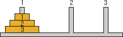

# 하노이 탑

---

## definition

- 기둥을 1, 2, 3 번으로 하고, N개의 원판이 작은 것부터 1, 2, 3, 4 … N이라고 할 때, 아래의 규칙에 따라 모든 원판을 3번 기둥으로 쌓기 위해 이동한다.

1. 한 번에 하나의 원판만 옮길 수 있다.
2. 큰 원판이 작은 원판 위에 있어서는 안 된다.

;

## Source

```c++

void hanoi(int n, int from, int tmp, int to) {
    if (n == 1)
      cout << from << to ;
    else
    {
        hanoi(n - 1, from, to, tmp);
        cout << n << from << to ;
        hanoi(n - 1, tmp, from, to);
    }
}

int main()
{
    int N;
    cin >> N;
    hanoi(N, 1, 2, 3);

    return 0;
}

```
