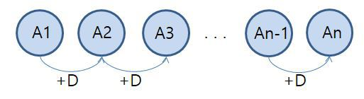

# 등차 수열

---

## 등차수열 이란?

- 각 항에 `일정한 수`를 더하여 다음 항을 만드는 규칙을 가진 수의 `나열`
- 일정한 수는 `공차`라고 한다.

;

## Example

```
1, 2, 3, 4, ... : 공차 = 1
1, 4, 7, 10, ... : 공차  = 3
```

## Source

```c++
  int n, an=1, sum=0;

  for(n=1;n<=10;n++)
  {
      sum=sum+an;
      printf("%2d항 : %2d\n", n, an);
      an=an+2;
  }
  printf("\nsum=%d\n", sum);

  return 0;
}

```
